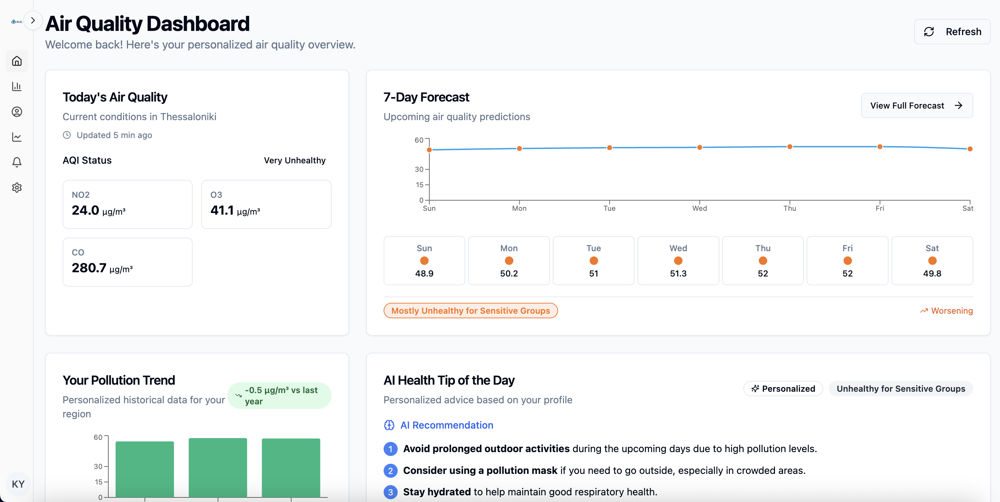

# ThessAir: Air Quality Forecasting and Health Insights

ThessAir is a web application that predicts air pollution trends across Thessaloniki’s municipalities and provides personalized health insights. It supports both **administrative users** (for data/model management) and **citizens** (for forecasts and health alerts), using public open data.

---

## 🎥 Demo Video

> Click the thumbnail above to see ThessAir in action — from model training to personalized health insights.

---

## 📌 Overview

- Forecast air pollution using historical datasets.
- Train models by pollutant, frequency (daily/monthly/yearly), and region.
- Receive AI-generated health suggestions based on your profile.
- Subscribe to AQI alerts (e.g., when NO₂ exceeds “Unhealthy” levels).
- Analyze long-term pollutant trends and seasonality.

---

## 🧠 Technologies Used

### Backend
- **FastAPI** — Python web framework
- **Prophet** — Time-series forecasting (Facebook Research)
- **PostgreSQL** via Supabase
- **Supabase** — Authentication, storage, and database
- **Docker** — Containerized development and deployment
- **Pandas**, **Scikit-learn** — Data handling and metrics

### Frontend
- **React + TypeScript**
- **Vite** — Lightning-fast build tool
- **Tailwind CSS**, **shadcn/ui** — UI components and styles
- **TanStack Query** — React query management

---

## 🗂 ER Schema

Below is the core data schema that powers the backend logic.

Key tables:
- `users`: Authenticated users
- `profiles`: Health data (asthma, smoker, age, etc.)
- `datasets`: Uploaded datasets with region/pollutant metadata
- `models`: Trained forecasting models
- `predictions`: Prediction outputs
- `recommendations`: Health suggestions (AI generated)
- `aqi_subscriptions`: User alert settings

---

## 🔁 App Flow

### For Admins
1. Upload CSV datasets (region/year).
2. Train models using:
   - Region
   - Pollutant (e.g., NO₂, O₃)
   - Frequency (daily/monthly/yearly)
   - Forecast length
3. View model metrics (MAE, RMSE) and status.
4. Compare models of different regions based on the pollutant.

### For Users
1. Login & complete your health profile.
2. Navigate the following features:
   - **Forecasts**: View model-based pollutant predictions. 
     Receive personalized suggestions based on health profile, aqi categories and forecasted exposure.
   - **AQI Alerts**: Get notified if thresholds are exceeded.
   - **Insights**:
     - Yearly trends
     - Monthly seasonality
     - Top polluted areas
   - **Dashboard**: Latest AQI + personalized health risk
   - **Health Profile**: Update your health sensitivities

---

## 🗃 Data Source

All data is sourced from:

**Open Knowledge Foundation Greece (OKFN)**  
[https://okfn.gr/](https://okfn.gr/)

---

## 🚀 Production Deployment (Render)

This app is deployed on Render:

Frontend: https://airq-frontend.onrender.com

Backend API base URL: https://airq-kqu2.onrender.com/api

No setup is needed to access the live app — the frontend and backend are fully integrated via environment variables and CORS.

---

## 🛠 Developer Info

- Add unit tests under `/test/` folder.
- All major backend logic lives under `/services/`.
- Supabase tables are mirrored in `/db/models.py`.

---

## 📚 Credits

This application uses publicly available air quality data provided by:

- **Open Knowledge Foundation Greece** — [https://okfn.gr](https://okfn.gr)

---

## 🤝 License

MIT License. See `LICENSE.md` for details.
